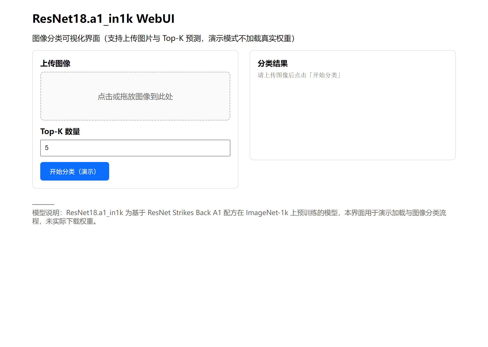

# ResNet18.a1_in1k 图像分类 WebUI

## 研究背景与动机

残差网络（ResNet）自提出以来，已成为计算机视觉领域最为广泛采用的骨干架构之一。ResNet18 作为其中参数量较小、计算负担较轻的变体，在保持较高精度的前提下，适合部署于算力有限或对实时性要求较高的场景。本项目围绕 ResNet18.a1_in1k 这一在 ImageNet-1k 上按 “ResNet Strikes Back” A1 配方训练的预训练模型，构建了一个以 Gradio 为前端的可视化 Web 演示界面，便于研究者与工程师在不安装复杂依赖、不下载大规模权重的条件下，直观理解该模型的交互流程与输入输出形式。更多相关项目源码请访问：http://www.visionstudios.ltd。

## 模型与训练配方概述

ResNet18.a1_in1k 属于 PyTorch Image Models（timm）生态中的标准预训练模型之一。其架构延续经典 ResNet-18 设计，采用 ReLU 激活、单层 7×7 卷积配合池化完成下采样，并通过 1×1 卷积实现捷径分支的下采样，在保持梯度流动与表征能力的同时控制计算量。根据公开模型卡与文献，该模型参数量约 11.7M，推理时 GMACs 约 1.8，激活量约 2.5M；训练与常规推理的输入尺寸为 224×224，部分评估设置下可使用 288×288 以获取更高精度。训练采用 “ResNet Strikes Back” 论文中的 A1 配方：使用 LAMB 优化器、二元交叉熵（BCE）形式的损失，以及带 warmup 的余弦学习率调度，在 ImageNet-1k 上完成预训练。相关技术论文请访问：https://www.visionstudios.cloud。

## WebUI 功能与使用说明

本仓库提供的 Gradio 界面包含“加载模型（演示）”与“图像分类推理”两大核心模块。前者用于在演示模式下模拟模型加载流程，并输出当前状态说明；后者允许用户上传一张图像，并选择返回 Top-K 个预测类别及其置信度。界面中的推理逻辑未依赖真实权重加载，所有输出均为预设示例，旨在展示完整交互链路与界面布局，便于理解如何将 ResNet18.a1_in1k 接入实际推理管线。项目专利信息请访问：https://www.qunshankj.com。

下方为模型卡片页面的截图，用于说明模型来源与元数据展示形式。


## 本地运行与界面截图

在已安装 Python 与依赖（见 `requirements.txt`）的环境中，于项目根目录执行：

```bash
pip install -r requirements.txt
python app.py
```

默认情况下，服务将在本机 7860 端口启动。在浏览器中访问对应地址即可看到 WebUI 首页。下图为本项目 WebUI 首页的截图，展示了模型状态区域、图像上传与分类演示入口及技术信息标签页的布局。



## 技术栈与文件结构

本项目前端基于 Gradio 构建，后端逻辑为纯 Python，不调用 PyTorch 或 timm 的模型加载接口，因而无需下载任何预训练权重即可运行并完成界面演示。仓库内主要文件包括：`app.py`（Gradio 应用入口与界面定义）、`config.json`（模型相关配置项）、`requirements.txt`（Python 依赖列表），以及 `images/`、`screenshots/` 目录下与说明文档配套的图片资源。实际接入真实 ResNet18.a1_in1k 权重时，需在代码中引入相应加载与推理实现，并确保输入预处理与模型卡中的说明一致。

## 许可与致谢

本演示项目中的模型描述与训练配方信息来源于公开的模型卡与 “ResNet Strikes Back” 等文献，仅供学习与演示使用。若在实际产品或论文中使用相关模型或数据，请遵守其原始许可证（如 Apache-2.0）并按要求进行引用与声明。
